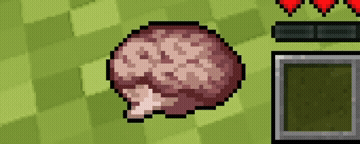
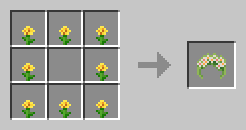

# Sanity: Renewed 🧠

Sanity: Renewed introduces a sanity meter inspired by Don't Starve, adding a new mechanic that forces players to manage their mental state alongside hunger and health. Darkness, isolation, hostile creatures, and dangerous situations slowly chip away at your sanity creating scary new situations & events around you, making the game harder.

  
  

As your sanity decreases, reality begins to distort around you. Strange sounds echo through the world, your vision becomes blurry and unstable, shadows move in the distance, and hallucinations begin to appear. Ignore your mental state for too long, and your mind will eventually manifest deadly creatures known as Inner Entities.

  
   
  Check out PIX ROXY's Showcase of Sanity: Descend into Madness

## Configuration 👁

Sanity: Renewed itself is a very flexible mod, with multiple config options for you to tweak your gameplay and make sure the entire playthrough is well tuned to your likings. If you have any suggestions on how to improve them or want to suggest new config options/new features let me know by making a new issue tracker on my repository.

The mod also includes dimension-specific configuration support through ``config/sanity_renewed/dimension/``, check ``example.toml`` to see & understand how to properly configure the mod per dimension. You're free to include this mod in your modpacks.

<table>
<tr>
<td valign="top" width="50%">

**Actions that DEPLETES your sanity (configurable):**

* Consuming bad food (like Rotten Flesh)
* Getting wet (rain & ocean)
* Receiving damage
* Being in the dark
* Difficult movement (Cobweb tangling)
* Listening to bad music (like Disc 11)
* Breaking infested blocks
* Being near monsters/enemies
* Hurting peaceful animals
* Having your dog/pets die
* Traversing between dimensions
* Provoking Enderman
* Being hungry
* Being thirsty
* Being too hot/cold

</td>

<td valign="top" width="50%">

**Actions that RESTORE your sanity (configurable):**

* Staying fed
* Being around your dog/pets
* Listening to good music
* Walking on dirt paths/carpets
* Being near campfires
* Sleeping through the night
* Catching fish
* Hatching chickens from eggs
* Earning advancements
* Husbandry (animal breeding/shearing)
* Trading with villagers
* Potting flowers
* Wearing a Garland

</td>
</tr>
</table>

## Important Notice
This is the 1.20+ unofficial continuation of Sanity: Descent Into Madness, originally created by croissantnova for Forge 1.16-1.20.1. The license is MIT, and i've decided to pick up the project since it hasn't been updated since 2023. Croissantnova [recently said he's working on a new project](https://github.com/croissantnova/SanityDescentIntoMadness/pull/93#issuecomment-2746349988) and he plans to get back to working on Sanity: Descent Into Madness when he deems it polished enough for publish. 

This version is a 1:1 rewritte of Sanity: Descend Into Madness, with support for newer versions, and all major modloader (forge/neoforge/fabric). I've also implemented some of the ideas that i saw on the old repo's issue tracker. I also want to thank [Desynq](https://github.com/Desynq) for his PR on the old repository that inspired me to rewritte the mod and implement the ideas he filtered out.

Credit goes to [croissantnova](https://www.curseforge.com/members/croissantnova/projects) for the original concept and implementation. If you enjoy this mod, consider supporting his future projects and of course, Sanity: Descend Into Madness, this project would never be here if it wasn't for his awesome work ❤️.

Check the original mod's page [[here]](https://www.curseforge.com/minecraft/mc-mods/sanity-descent-into-madness), for older versions and to give the original authors support

#### Credits
* [croissantnova](https://github.com/croissantnova) - programmer and artist, 
* [toujourspareil](https://twitter.com/toujourspareil_) - artist.
* [Desynq](https://github.com/Desynq) - major changes & inspirations ([PR #93](https://github.com/croissantnova/SanityDescentIntoMadness/pull/93))
* Sound effects provided by [Zapsplat](https://www.zapsplat.com/)

#### License
See [license](https://raw.githubusercontent.com/croissantnova/SanityDescentIntoMadness/main/LICENSE).

## Requirements: 
Forge/Neoforge:
* [**Architectury API**](https://www.curseforge.com/minecraft/mc-mods/architectury-api)
* [**GeckoLib**](https://www.curseforge.com/minecraft/mc-mods/geckolib)

Fabric:
* [**Architectury API**](https://www.curseforge.com/minecraft/mc-mods/architectury-api)
* [**GeckoLib**](https://www.curseforge.com/minecraft/mc-mods/geckolib)
* [**Forge Config API Port**](https://www.curseforge.com/minecraft/mc-mods/forge-config-api-port)

  
  

